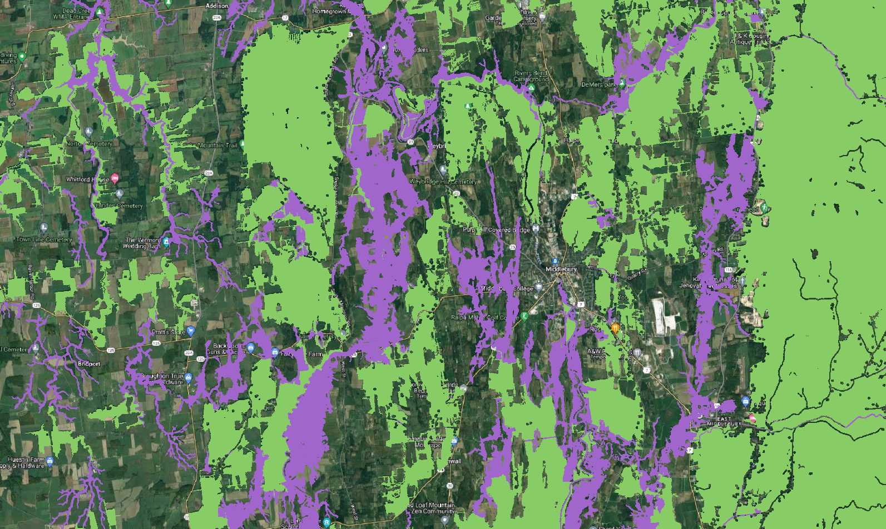

# Forest habitat connectivity in Champlain Lowlands 

## For GG352 students  

This repo provides a worked out example of a modeling workflow that moves between Earth Engine and Whitebox. Please see if you can reproduce the six scripts based on the information provided below. (This should only require you to alter the working directory path in Whitebox scripts and create directories for storing outputs and exports).  

Please write down any questions you have for any portions of each workflow. Please think about:  

1. What parts of each workflow seem unfamiliar to you? 
2. Are there sequences of moves that you find difficult to follow or explain?

Please be prepared to ask me specific questions in seminar next week.    

## Purpose  

The goal of this project is to identify a connected system of habitat blocks and connectors (Act 171) in the Champlain Lowland Region of Addison County, Vermont. This project builds on the Vermont Conservation Design (VCD) approach to modeling landscape elements (forest habitat blocks and valley bottom connectors), while recognizing that the environmental history of the Champlain Valley differs from the upland regions of the state.  

Over the last two centuries, land use changes in Vermont's mountainous areas have allowed significant recovery of forest habitat. In these regions, conservation goals aim to identify large blocks of forest habitat to protect from future fragmentation. 

In the Champlain Lowland, agriculture and other land use activities that prevent forest habitat recovery have been more persistent. As a result, forest habitats in the Champlain Lowland form patches that are small in size, long in perimeter, and biased on rocky and swampy lands that are historically difficult to farm.  

This project aims to explore the following questions:  

1. How does the VCD concept of "core" habitat in forest blocks bias conservation priorities in the Champlain Lowland? 

2. How does the current landscape pattern of forest habitat function for connectivity and representativeness?  

3. What valley bottom/riparian areas have the greatest potential for improving connectedness and representativeness of forest habitat in the Champlain Lowlands?

## Expected results   

This project aims to identify three zones with conservation recommendations in the Champlain Lowland. 

| COLOR | ZONE DESCRIPTION | RECOMMENDATIONS |
|:---:  | :--- | :--- |  
| <b> GREEN </b> | Priority forest habitat blocks. These are patches in between development and agriculture that are characterized by tree canopy, shrub, and grass land cover with high functional value for habitat, rarity, connectedness, and representativeness. | Protect and promote forest habitat; discourage long single- and multi- residence driveways. |  
| <b> PURPLE </b> | Potential habitat connectors. These valley bottom and riparian corridors connect two or more existing forest habitat blocks but are currently used for agriculture. They have high value to improve connectedness and representativeness of forest habitat. | Protect farmlands and natural reserves; encourage and incentivize reforesting and restorative agriculture. |
| <b> BLUE </b> | Surface waters. | Protect nearshore riparian habitat. |

---  

  

_A screen shot of an initial model run that prioritizes blocks based on core area and rarity and identifies valley bottoms in agriculture that improve overall connectivity._ 

## Workflow  

The model consists of the following routines.  

| STEP | SCRIPT | SOURCE | DESCRIPTION |
| :--:  | :---   | :---:   | :---        | 
| 1 | dem_10m | [ee repo][ee-repo] | Load and export USGS 3DEP 10m for study region. |   
| 2 | lowlands.py | [github][ll] | Classify landforms from 10m DEM, isolate valley bottoms, and remove developed regions from valley bottoms. The resulting layer represents potential locations to maintain connectedness of habitat fragments. |  
| 3 | clearings.js | [ee repo][ee-repo] | Identify clearings maintained by human activity from landcover and e911 footprints; export as geoTiff.  |  
| 4 | rarity.js | [ee repo][ee-repo] | Identify rare natural communities and rare plant locations from ANR natural heritage datasets. This contributes to the block qualities assessment (along with core area of blocks). |   
| 5 | blocks.py | [github][hb] | Identify blocks of habitat with qualities that make them conservation priorities. Invert clearings to represent contiguous blocks of reforesting habitat, isolate core habitat at least 200 meters from edge, isolate cores that are greater than five acres. Combine recovering blocks that include either rare natural communities or rare plant species. The resulting layer identifies blocks with rare natural communities, rare plant locations, or containing a 'core' area (200 meters distant from edge) of five acres or more. |  
| 6 | connectors.py | [github][hc] | Select valley bottoms that connect two or more priority blocks. Check that connectors and blocks create continuous habitat for study region. |   

[ee-repo]: https://code.earthengine.google.com/?accept_repo=users/jhowarth/college-lands   

[ll]: lowlands.py

[hb]: blocks.py  

[hc]: connectors.py

[ee-app]: https://vt-conservation.projects.earthengine.app/view/act-171-champlain-lowlands-addison-county 