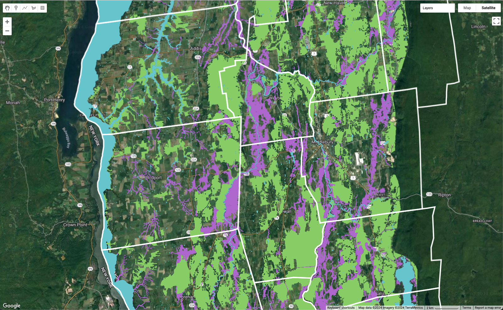

# Forest habitat connectivity in Champlain Lowlands 

  

[_Click here for a map of current results._][ee-app] 

| COLOR | DESCRIPTION | RECOMMENDATIONS |
|:---:  | :--- | :--- |  
| <b> GREEN </b> | Priority forest habitat blocks. | Protect forest cover; discourage long single- and multi- residence driveways. |  
| <b> PURPLE </b> | Habitat connectors including both early successional lands and current agricultural lands. | Protect farmlands and natural reserves; encourage adaptive agriculture and reforesting corridors. |
| <b> BLUE </b> | Surface waters. | Protect nearshore riparian habitat. |

## Description  

This project identifies a connected system of habitat blocks and connectors (Act 171) in the Champlain Lowland Region of Addison County, Vermont. The network connects >95% of all priority blocks to one or more other priority blocks via valley bottom connectors.  

It consists of the following routines.  

| STEP | SCRIPT | SOURCE | DESCRIPTION |
| :--:  | :---   | :---:   | :---        | 
| 1 | dem_10m | [ee repo][ee-repo] | Load and export USGS 3DEP 10m for study region. |   
| 2 | lowlands.py | [github][ll] | Classify landforms from 10m DEM, isolate valley bottoms, and remove developed regions from valley bottoms. The resulting layer represents potential locations to maintain connectedness of habitat fragments. |  
| 3 | clearings.js | [ee repo][ee-repo] | Identify clearings maintained by human activity from landcover and e911 footprints; export as geoTiff.  |  
| 4 | rarity.js | [ee repo][ee-repo] | Identify rare natural communities and rare plant locations from ANR natural heritage datasets. This contributes to the block qualities assessment (along with core area of blocks). |   
| 5 | blocks.py | [github][hb] | Identify blocks of habitat with qualities that make them conservation priorities. Invert clearings to represent contiguous blocks of reforesting habitat, isolate core habitat at least 200 meters from edge, isolate cores that are greater than five acres. Combine recovering blocks that include either rare natural communities or rare plant species. The resulting layer identifies blocks with rare natural communities, rare plant locations, or containing a 'core' area (200 meters distant from edge) of five acres or more. |  
| 6 | connectors.py | [github][hc] | Select valley bottoms that connect two or more priority blocks. Check that connectors and blocks create continuous habitat for study region. | 

[ee-repo]: https://code.earthengine.google.com/?accept_repo=users/jhowarth/college-lands   

[ll]: lowlands.py

[hb]: blocks.py  

[hc]: connectors.py

[ee-app]: https://vt-conservation.projects.earthengine.app/view/act-171-champlain-lowlands-addison-county 